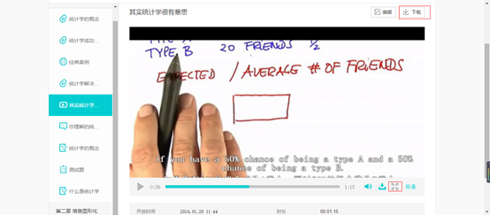
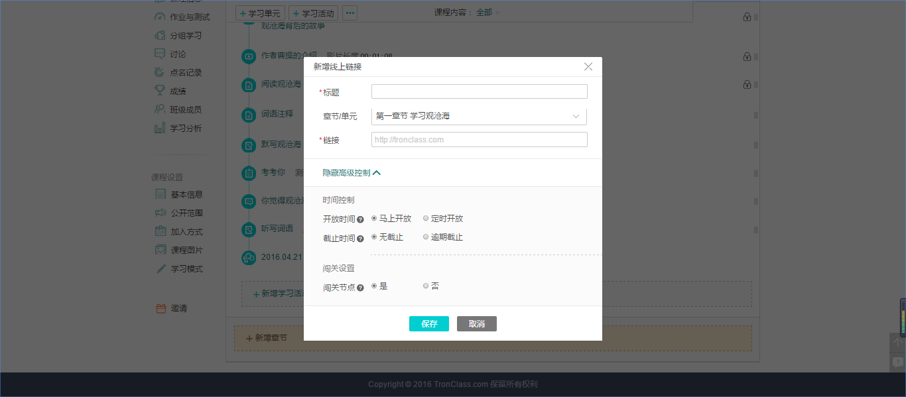
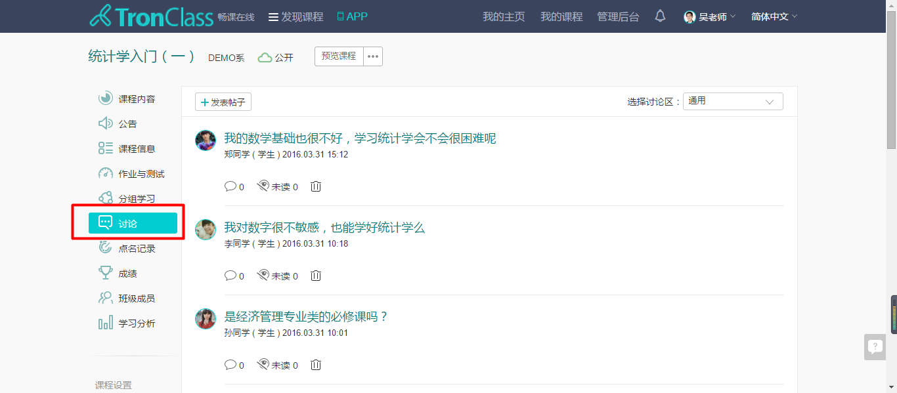
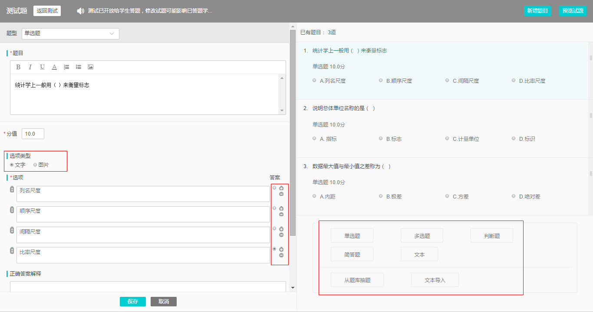
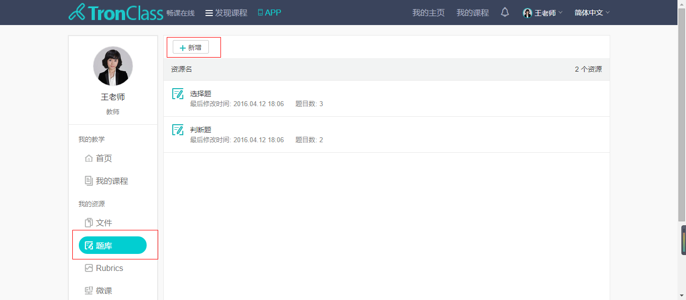
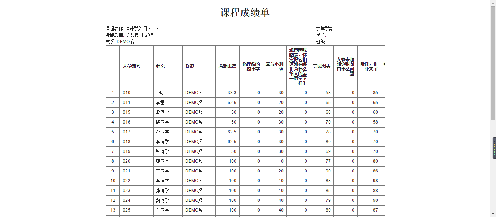
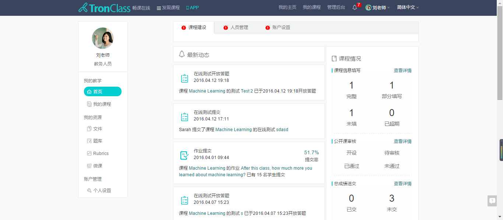
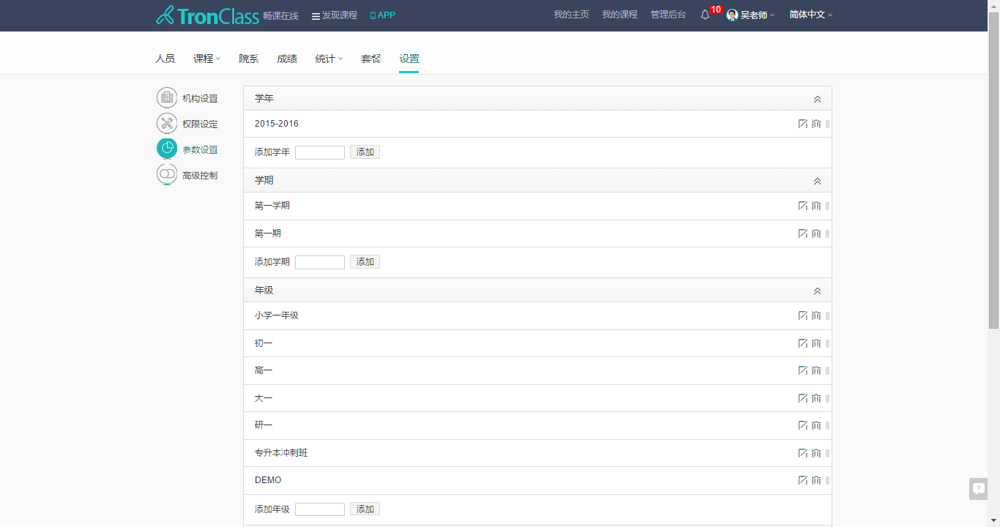
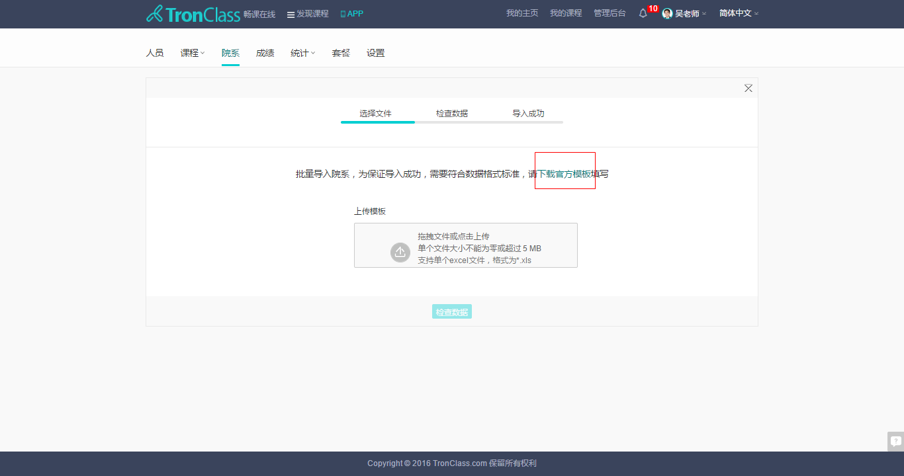
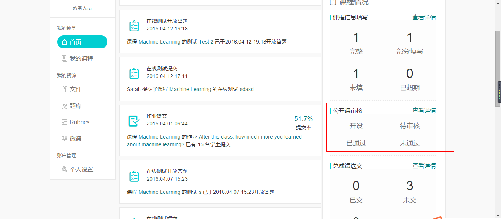

前言
=====
>对于老师，TronClass不仅能够帮助你创造出精彩且形式丰富的课程，而且会让你第一时间了解课堂的教学效果，管理学生学习路径，并且使用方式非常灵活自由，你可以根据自己的需求应用在课前、课中和课后，接下来的内容将会帮助你全面了解TronClass

>对于学生，TronClass是一个非常有趣的学习管理平台，你即将要学习的课程可能由很多有趣的东西组成，它有音视频、讨论区、网页…你可以在这里完成所有的课程学习、作业以及考试，接下来让我带你看看TronClass的世界

目录 (Table of Contents)
=============

[1.课程及教学活动介绍](#section1)

- [1.1 建立课程及课程类型介绍](#section1.1)
     -  [1.1.1	如何新建课程（以老师身份）](#section1.1.1)
     -  [1.1.2  轻量级课程](#section1.1.2)
     -  [1.1.3  进阶式课程](#section1.1.3)
- [1.2 学习活动介绍](#section1.2)
     -  [1.2.1	影音教材](#section1.2.1)
     -  [1.2.2  参考文件](#section1.2.2)
     -  [1.2.3  线上链接](#section1.2.3)
     -  [1.2.4  页面](#section1.2.4)
     -  [1.2.5  讨论](#section1.2.5)
     -  [1.2.6  在线测试](#section1.2.6)
     -  [1.2.7  作业](#section1.2.7)
     -  [1.2.8  课堂](#section1.2.8)
     -  [1.2.9  微课](#section1.2.9)
- [1.3 公告、成绩管理及学习分析](#section1.3)
     -  [1.3.1  公告](#section1.3.1)
     -  [1.3.2  成绩管理](#section1.3.2)
     -  [1.3.3  学习分析](#section1.3.3)

[2.TronClass的管理模式](#section2)

- [2.1  TronClass中的角色设定及管理](#section2.1)
     -  [2.1.1  机构版中的角色职能](#section2.1.1)
     -  [2.1.2  个人版中的角色职能](#section2.1.2)     
- [2.2  TronClass如何管理机构、人员、课程](#section2.2)
     -  [2.2.1  设置机构结构信息](#section2.2.1)
     -  [2.2.2 添加院系](#section2.2.2)
     -  [2.2.3 添加人员](#section2.2.3)
     -  [2.2.4 院系、人员管理方式](#section2.2.4)
     -  [2.2.5 管理员身份建课](#section2.2.5)
     -  [2.2.6 课程的公开及加入方式](#section2.2.6)
     -  [2.2.7 把人员导入课程](#section2.2.7)

[3.TronClass APP介绍](#section3)

- [3.1  TronClass APP各版本区别](#section3.1)
     -  [3.1.1  个人版](#section3.1.1)
     -  [3.1.2  机构版](#section3.1.2)
     -  [3.1.3  私有云版](#section3.1.3)

#1.课程及教学活动介绍

##1.1	建立课程及课程类型介绍

### 1.1.1	如何新建课程（以老师身份）
- 点击“我的课程”> 点击“新建课程”
- 超级管理员、教务也可以作为老师的角色，开课授课

### 1.1.2   轻量级课程
- 轻量级课程适用于学习时程短，主题明确，以微视频为核心教学资源来开展的，可以作为一门课程、也可以通过轻课程开展课前或课后知识补充，应用在企业可能会作为精品课程的试看课程或宣传公开课

- 目前轻课程仅支持影音视频和参考文件两类学习活动，没有测试作业等其他的学习活动，老师们在选择课程类型是需要注意一下

- 提供课堂互动讨论区，学生和老师可以在这里自由交流讨论

### 1.1.3   进阶式课程
- 进阶式课程适用于有清晰的章节结构，课程内容较为丰富，时程较长的课程
- 支持丰富的学习活动，老师组织课程的方式广泛且非常自由，比如在课前导学，老师可以将背景知识等通过丰富的学习活动巧妙的组织起来，吸引学生观看学习；课后，还可以布置测试或作业，管理检测学生的学习效果

##1.2	学习活动介绍

###1.2.1 影音教材
- 你可以添加通过视频网站找到的教学资源，只需要在浏览器中复制这个视频的链接地址就可以了，目前支持优酷、土豆、网易、搜狐、Youtube等视频的链接导入

- 你也可以上传本地视频，并对本地视频进行高级控制的设置，如开放时间，是否允许下载等
- 	注意：
1.	机构版，本地视频大小通常限制上限为2GB，视频越大转码需要的时间就越长
2.	个人版总容量为2GB，如果上传较大的视频可以联系客服增加容量

*- 学生观看本地视频时可以进行全屏播放，如果老师开放下载还可以进行下载*

###1.2.2 参考文件
- 你可以把很多有益于教学的各类参考文件添加在课程中，目前支持大部分通用Office文档格式及图片音频

- 在设置的时候你也可以对参考文件进行高级控制，开放时间、截止时间等，参考文件是默认学生可以下载的

*- 学生可以在线全屏预览参考文件，如果需要可以随时点击下载*

###1.2.3 线上链接
-	在网上找到知识点的百科或者论坛中的帖子，你都可以直接在浏览器里复制链接添加到课程中，学生查看时点击此类学习活动会直接跳转到该网页

###1.2.4 页面
-	如果不想学生跳转到另外的网页，您可以把网页中的内容直接复制到“页面”这个学习活动，学生点开后就像在线看帖一样，非常方便
-	第一步 复制网页中的文字或图片

- 	第二步 直接粘贴在页面学习活动中

*- 学生的点开后不用跳转到别的网页，就像看帖一样*

###1.2.5 讨论
- 	讨论分课程讨论区和学习活动讨论；
- **课程讨论区**是为学生与老师设置的自由讨论区，没有任何限制，可以用于课程的互动答疑、自由讨论，并且是聚合课程内所有讨论内容的区域

*- 学生在这个区域里可以发表帖子、回复，轻松检索到课程中所有的讨论内容，包括通用的自由讨论区和章节单元下的讨论活动**

- **学习活动讨论**，应用于课程的某个章节单元下，是专门针对于某个知识点的内容讨论，老师可以为讨论设置评分计入学生的成绩

###1.2.6 在线测试
- 添加在线测试学习并进行编辑设置，如开放时间、答题次数、成绩比例、成绩公布时间、题目选项的排列方式等，设定选项非常丰富，老师的自由度非常高

- 设定好后会进入基本信息页面>点击管理测试题目，进入出题界面

- 支持多种题型，如单选、多选、判断和简答，左侧编写题目内容右侧实时查看题目状态，所见即所得；选项除了文字还支持图片，增加减少选项、正确选项一目了然非常方便，还可以对题目进行正确答案解释

- 除了逐题录入的方式，我们还提供**题库抽题**和**文本导入**的方式
   - **题库抽题**：老师可以利用题库事先录入已有题目，在平台建立测试时就可以直接从题库中抽题
   - 首先建立题库，我的主页>进入题库>新增题库>录入题目>保存

   - 在添加在线测试时选择题库抽题，设定每道题的分值和抽题数目就可以了  

   - **文本导入**的方式是为了方便已经有大量题目内容的老师，直接复制题目到文本框内，根据帮助帮助信息的内容添加特殊符号的标记完成题目的批量导入!

- *学生答题也非常方便，点击进入在线测试根据老师设置的要求进行答题就可以，比如可以答两次等等，完成测试便会得知测试得分*

-	*而且学生可以及时查看自己的答题状况，哪道题错了，正确答案是什么*

###1.2.7 作业
- 提供两种作业形式：**个人作业**和**分组作业**
  - **个人作业**是创建作业学习活动默认的作业形式，每个学生都要提交，而且作业的展现形式可以非常多样，老师可以上传任何附件（图片、文档、音视频等） 来组织作业
  
  - *学生点击作业>查看相应的介绍及要求>点击我的答案>交付作业（这里你可以上上传任何形式的附件如影音文件、office文档等，也可以直接在文本框中编写）*
  
-  分组作业是应用在团队协作学习中，让学生以小组的形式共同完成一份或几份作业而设定的
  - 先将学生分组，我的课程>进入课程>点击分组学习>新增分组，并且任命小组组长>点击保存
  
  
  -  添加作业时，打开“显示高级控制”>点选分组作业>选择相应的Rubric
  
-	提供多种评分方式：**老师评阅**、**学生互评**、**分组互评**和**Rubric评分计量表**
 -	**老师评阅**是由老师对学生的作业进行打分，老师进入布置的作业学习活动>点击作业批改>进行打分>如果某个学生的作业非常优秀，老师还可以把这份作业推送给所有提交的同学
 
  -	学生互评是学生之间相互打分，应用在个人作业中的互评方式，只要是互评的作业，都会默认使用Rubric，它是一种评分计量表工具，老师可以自定义评分规则，让学生有一定的参照，不至于出现评分混乱无标准的状况
 
  -  *学生在使用互评时，当提交了自己的个人作业后，系统会随机抽取另一位同学的作业给到他进行评分，学生按照Rubric进行打分，并且可以写下自己的对这份作业的看法*
  

  - 分组互评是指小组之间的互相评分，应用在分组作业当中的评分方式，老师在布置作业时在评分方式中选择分组互评与相应的Rubric即可 
 
  -	学生可以在分组学习中查看分组作业，也可以在章节内容中查看分组作业，分组互评每小组只需提交一份作业即可，每组学生都会对其他组的作业给出一个评分，然后取评分的平均值
  
  

###1.2.8 课堂
- 课堂是配合畅课APP让老师利用手机、平板实现翻转教学的，应用在课中实时教学，它有两个功能：
  ①	**设置教学反馈调研问卷**，实时了解学生对课程或某一知识点的学习状况，一方面能方便的统计班级整体对课程反馈建议，另一方面也是建立一个良好的课堂互动机制，让不敢提意见的学生大方反馈自己的感受
  ② **设置随堂测**，老师讲完某一知识点或者某一章节时，可以通过随堂测及时检验学生的掌握情况，与在线测试不同的是，需要老师主动开放学生才能在手机端看到
- 点击添加课堂学习活动，只需输入名称即可>点击编辑进行参数设置>总体控制是指，如随堂测有5道  题，老师主动开放时学生能看到全部的题目，控制整体的开启和关闭；逐题控制则需要控制每一道题的开启和关闭

- 点击管理测试题目，像在线测试那样录入题目即可，目前随堂测只支持单选题和多选题>点击保存设置完成

- PC端设置完成后>老师进行课中线下教学，配合教学内容需要用到教学反馈和随堂测时>用手机登录TronClass APP>点击课堂就能看到自己设置活动 

-点击进入就可以编辑反馈问卷>点击开始进行教学反馈活动或者同时开启随堂测进行答题都可以

- *学生登录手机APP，在课程中就能看到相应的随堂测，进行答题反馈*

- 老师就能在手机端轻松查看学生的答题状况以及对课程的反馈

###1.2.9 微课
-  微课是提供给老师录制视频课程的工具，支持多种形式方便老师选择适合自己的形式
-	我的主页>点击微课>点击新增>提供多种录制形式>点击保存

- 点击右上角的录制按钮

- 系统会提示你下载主播组件，点击下载即可

- 接下来你会看见录制程序的窗口，首先会有选择录制窗口范围的窗口设置，你可以根据需求调整录制区域大小，不要关闭此窗口，最小化即可 

- 选择需要上传的资料，目前支持的格式有PPT、PDF、JPG图片，大小不能超过30M

- 如果右上角的区域未显示出老师的影像，则需要确认两点：
1.	电脑是否具备摄像头，且能正常工作
2.	在设置中>视频来源>选择USB HD WebCam

- 点击开始录制

- 老师在录制的过程中可以通过左上角的工具对重点以及需要标注的信息进行标记
同时你可以对资料中的知识点进行课外补充，插入外网的链接，点击红框部分的按键

- 输入链接及标题说明，学生在看到这个部分的时候就会自动弹出此链接及说明

- 在录制的过程中你可以随时点击暂停-开始继续录制，点击停止键完成录制，回到下方页面，点击刷新>发布，此微课就存到你的微课资源库中了

- 回到需要添加微课的课程中，添加微课学习活动，输入标题，在下方直接选择需要添加的微课就可以了

##1.3 公告、成绩管理及学习分析

###1.3.1 公告
- 公告以课程为单位，老师在每个课程中发布相应的通知，比如课程增加内容需要特别提醒、截止时间的特别提醒等，学生在登录时会收到相应提醒

###1.3.2 成绩管理
- 老师可以很轻松的看到整个班级到每个学生的成绩状况，每个测试、每个作业以及考勤的得分，都可以在这里清晰的展现出来，多元化的成绩组成方式老师可以根据班级状况自由调整

点击显示图表，直观的班级总成绩统计，一目了然

- 点击查看成绩单，方便老师打印纸质版

- *而学生则可以清晰的看到自己的成绩组成，哪里得分比较低，在班级中处于什么样的水平*

###1.3.3 学习分析
- 学习分析给老师提供了一个非常方便的学习监控工具，老师可以通过它对每个学生的学习路径进行管理，对比传统的班级教学，学习分析让老师更每一个学生，更了解每个学生对课程的掌握状态，便于及时调整教学方式或讲授重点
- 总览课程的访问状况，细致到每个学习活动的访问状况的统计

- 课程完成度的统计，清晰监控每个学生的学习路径

#2. TronClass的管理模式

##2.1 TronClass中的角色设定及管理

###  2.1.1 机构版中的角色职能
- 机构版中目前一共有四种角色：超级管理员、教务、老师、学生
- 另：机构版所有的角色的只能通过机构在畅课中的二级域名登录
- http://（机构域名）.tronclass.com.cn
- **超级管理员**：
   1. 在机构中拥有最高权限，也同时具备其他角色的职能，也就是说它也可以执行教务和老师的工作
   2. 总览全局，对机构中的课程、人员、访问量都可以一目了然的查看

   3. 只有超管可以设置机构的整体结构，如域名、名称logo、学年学期、院系班级等

- **教务**：
   1. 主要职能辅助超级管理员管理机构、帮助管理员和老师添加机构人员、将人员导入课程、公开课审核及成绩汇总
   2. 教务同时也可以作为老师进行开课授课

- **老师**：
   1. 开课授课、布置作业、测试，管理学员的学习路径、成绩
   2. 老师并不具有添加人员的权限，只能通过课程邀请码的方式邀请学员加入

###  2.1.2 	个人版中的角色职能
- 个人版中只有两种角色：老师、学生，职能与机构版中的老师学生是一样的，开课授课、布置作业、测试，管理学员学习路径、成绩
- 老师如想邀请学员加入课程，只能通过课程邀请码，将连接发给学生，引导学生自行注册学习

- 另：个人版所有的角色的需要通过畅课官网登录，http://tronclass.com.cn

##2.2 TronClass如何管理机构、人员、课程

###2.2.1 设置机构结构信息
- 执行角色：**超级管理员**
- 在首页的机构建设中点击去设置或去更改，抵达后台管理-设置页面

- 在机构设置项里，你可以设置机构的名称和logo

- 以及机构的二级域名，这也是以后机构用户登录的地址（可以随时更换）

- 并且还可以设置机构的轮播图片，用于机构运营宣传，每张图片都可以添加一个自定义链接，像机构的新闻要事、优惠活动等都可以通过它来进行宣传

效果见下图

- 在参数设置项中，超级管理员可以对机构的人员和课程添加相应的标签，课程和人员会不断增加，有了学年、学期、班级这些标签会让管理者更方便管理检索到相关的课程或人员

- 在高级控制项里，超级管理员可对教务开放部分权限，并且可以设置机构课程列表和用户管理开关，具体介绍详见平台内

###2.2.2 添加院系
- 执行角色：**超级管理员**
- 管理后台>院系

- 逐个添加院系，点击新增>输入要添加的院系名称和院系代码>点击保存，院系代码为自定义，主要是为了方便后期检索

- 批量添加院系，点击批量导入>下载官方模板

- 打开Excel模板>按照要求填写院系信息>保存Excel

- 将Excel拖进红框区域>系统会先检查数据是否正确>确定导入即可

###2.2.3 添加人员
- 执行角色：**超级管理员或教务**
- 管理后台>人员>新增或批量导入

- 新增>填写必要信息，如姓名、编号、邮箱、（用于接收开通邮件和找回密码）>保存后该人员的邮箱就会收到一封系统开通邮件，包含姓名、编号和初始登录密码

- 批量导入>下载官方模板>按照Excle上方要求进行填写必要信息，在这里你可以为学生设置统一密码>保存，将Excel拖进红框区域>系统会先检查数据是否正确>确定导入即可

###2.2.4 院系、人员管理方式
- 当我们设置好院系和人员时，机构中的教务即使添加了院系年班级的归属，同样也是有权限可见并管理所有院系的学生
- 所以，如果有多名教务分属不同院系，各院系需要独立管理时，我们可以配合后台设置中的“权限设定”来进行分组管理，比如归属新闻传播学院的教务只能管理该学院的老师和学生，类似微信朋友圈分组可见
- 管理后台>设置>权限设定>新增群组>保存

- 编辑群组

- 添加群组成员，相应院系教务人员，以及设定好管理院系

- 这样我们就设置好了分组，每个归属相应院系教务，只能可见相应院系归属的学生、老师（超级管理员依然全局可见）

###2.2.5 管理员身份建课             
- 管理员（超级管理员或教务）作为机构的管理者，有时会规划整个学年的课程，但这些课程的内容可能由其他老师来完成的时候，他们只需要负责搭建框架并且指定授课老师就可以了
- 后台管理>课程管理>新增课程>填写课程必要信息
注：授课老师必须先通过人员已经添加到了机构中，才可以搜索到，添加授课老师后，该老师就可以在我的课程中看到这门课的框架并进行内容的完善

###2.2.6 课程的公开及加入方式
- 执行人员：**老师和教务**
- 我的课程>需要公开的课程（无论是管理员建立的课程还是老师建立的课程都默认为私有课程）>公开范围

- 更改为公开课程，进入审核流程

- 同时老师也可以调整这门课的加入方式，可选公开加入或仅邀请加入，具体说明详见平台

- 老师提出申请后教务能在自己的主页中收到公开课程的申请，教务人员可对课程进行审核是否公开课程

- 审核通过后，课程会显示在机构的主页中

###2.2.7 把人员导入课程
- 执行人员：**超级管理员或教务**
- 管理后台>课程管理>编辑要导入学员的课程

- 添加修课人员>勾选需要添加的人员设定好角色>点击添加

- 被添加的人员登录自己的账号，就可以在我的课程中看到这门课

#3. TronClass APP介绍

## 3.1 TronClass APP各版本区别

### 3.1.1 个人版
- 搜索关键词：“tronclass”，应用图标和说明没有特定词语限制
- 苹果用户可直接在Apple store进行搜索，安卓建议在应用宝中搜索，中国大陆地区以外的用户可在“Google Play”中搜索

### 3.1.2 机构版
- 搜索关键词：“tronclass机构版”，应用图标和说明都有“机构版”的字样，此版本专属于机构用户，拥有机构版PC端所有基础功能
- 苹果用户可直接在Apple store进行搜索，安卓建议在应用宝中搜索，中国大陆地区以外的用户可在“Google Play”中搜索

### 3.1.3 私有云版
- 搜索关键词：“tronclass私有云”，应用图标和说明都有“私有云”的字样，此版本专属于私有云定制客户
- 苹果用户可直接在Apple store进行搜索，安卓建议在应用宝中搜索，中国大陆地区以外的用户可在“Google Play”中搜索
